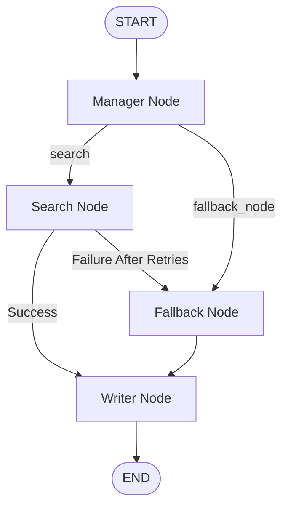

# 🛡️ Agentic Circuit Breaker (Jarvix Core Module)

A fault-tolerant AI orchestration workflow built with LangGraph that automatically degrades gracefully when search services fail.

The system acts as a resilient gateway between user requests and external information sources. When an API, network connection, or retrieval service becomes unavailable, the workflow trips a circuit breaker and routes execution to fallback mechanisms without crashing the application.

---

## 🎯 Purpose

Modern AI systems often depend on external APIs, search engines, and retrieval services.

When these dependencies fail, most applications either:

* Crash
* Return empty responses
* Hang indefinitely
* Produce unreliable outputs

The Agentic Circuit Breaker solves this problem by introducing:

* Intelligent routing
* Retry mechanisms
* Fallback retrieval
* Graceful degradation
* State-aware orchestration

---

## 🏗️ System Architecture

The workflow is implemented as a LangGraph state machine.



### Workflow Overview

#### 1. Manager Node

The manager acts as the orchestration layer.

Responsibilities:

* Analyze workflow state
* Decide routing strategy
* Select external retrieval or fallback path
* Maintain workflow control

---

#### 2. Search Node

The primary retrieval system.

Responsibilities:

* Execute external searches
* Retry failed operations
* Detect network instability
* Trigger circuit breaker logic

Features:

* Configurable retry count
* Network failure handling
* Error logging
* Graceful recovery

---

#### 3. Fallback Node

Activated when the primary retrieval system fails.

Responsibilities:

* Query local vector database
* Retrieve cached or historical context
* Continue workflow execution

Features:

* ChromaDB integration
* Similarity search
* Offline recovery mode

---

#### 4. Writer Node

Generates the final user-facing response.

Responsibilities:

* Consume retrieved context
* Handle degraded system states
* Produce structured answers
* Prevent hallucinations when fallback mode is active

---

## 🔄 Circuit Breaker Behavior

### Normal Flow

```text
Manager
   ↓
Search
   ↓
Writer
   ↓
End
```

### Failure Flow

```text
Manager
   ↓
Search
   ↓
Search Retry #1
   ↓
Search Retry #2
   ↓
Search Retry #3
   ↓
Fallback
   ↓
Writer
   ↓
End
```

The application never crashes due to external service instability.

---

## 📂 Project Structure

```text
Circuit_Breaker/
│
├── .env
├── .gitignore
├── README.md
│
├── Circuit_Breaker.log
│
├── venv/
│
└── app/
    ├── config.py
    ├── main.py
    └── prompts.py
```

### File Overview

| File                | Purpose                                            |
| ------------------- | -------------------------------------------------- |
| config.py           | Application configuration and environment settings |
| main.py             | State machine topology and workflow execution      |
| prompts.py          | LLM system prompts and templates                   |
| .env                | Environment variables and API keys                 |
| Circuit_Breaker.log | Workflow telemetry and execution logs              |

---

## 🧠 Core Concepts Demonstrated

This project demonstrates several production-grade AI engineering concepts:

### State Management

Uses a strongly typed LangGraph state object:

* Query tracking
* Error tracking
* Fallback tracking
* Message history
* Retrieved data
* Final response storage

---

### Retry Logic

External retrieval operations are retried automatically before triggering fallback mode.

Benefits:

* Handles transient failures
* Improves resilience
* Reduces unnecessary degradation

---

### Graceful Degradation

When external services become unavailable:

```text
External Search
      ↓
Failure
      ↓
Fallback Retrieval
      ↓
Response Generation
```

The system remains operational.

---

### Observability

Comprehensive logging is implemented across every workflow stage.

Examples:

* Workflow startup
* Route selection
* Search attempts
* Search failures
* Fallback activation
* Response generation

This enables easy debugging and production monitoring.

---

## 🛠️ Tech Stack

### Orchestration

* LangGraph

### LLM Layer

* LangChain
* Groq
* Llama 3.3 70B Versatile

### Retrieval

* DuckDuckGo Search

### Vector Database

* ChromaDB

### Embeddings

* HuggingFace Embeddings

### Validation

* Pydantic

### Configuration

* Pydantic Settings
* Python dotenv

### Logging

* Python Logging

---

## 🚀 Installation

### 1. Clone Repository

```bash
git clone https://github.com/Rex-Code-debug/circuit-breaker.git
cd Circuit_Breaker
```

### 2. Create Virtual Environment

```bash
python -m venv venv
```

### 3. Activate Virtual Environment

Windows:

```bash
venv\Scripts\activate
```

Linux / macOS:

```bash
source venv/bin/activate
```

### 4. Install Dependencies

```bash
pip install -r requirements.txt
```

---

## 🔑 Environment Variables

Create a `.env` file in the project root.

```env
GROQ_API_KEY=your_api_key_here
```

## ▶️ Run The Workflow

```bash
python app/main.py
```

---

## 📈 Future Improvements

Planned enhancements:

* Redis-backed circuit breaker state
* Exponential backoff retry strategy
* Multi-provider search routing
* Metrics dashboard
* LangSmith tracing
* Async workflow execution
* Persistent workflow checkpoints
* Adaptive routing using reinforcement feedback

---

## 👨‍💻 Author

Built as part of the Applied AI Engineering Roadmap.

Focus Areas:

* AI Systems Engineering
* Fault-Tolerant Workflows
* Agentic Architectures
* LangGraph Orchestration
* Retrieval-Augmented Systems
* Resilient AI Infrastructure